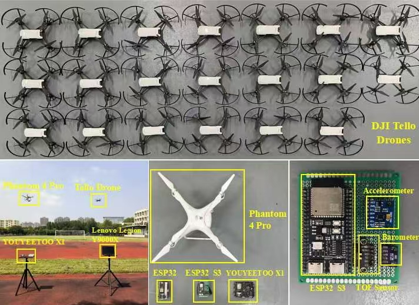

**Introduction to the SecureLink dataset**

This dataset presents synchronized channel state information (CSI) and  sensor measurements collected from twenty DJI Tello drones (IDs 0–19) and two ESP32-based platforms (IDs 20–21) rigidly mounted on a DJI Phantom 4 Pro. Over a series of flights lasting more than twelve hours across multiple days, we captured data under four distinct environmental conditions—rooftop (labels 1–5), playground (labels 6–10), corridor (labels 11–15), and office (labels 16–20)—with dynamic maneuvers (up, down, left, right, rotate) applied to the drones. Five additional static trials (labels 21–25) were conducted in the office setting, wherein the UAVs remained powered on without propeller activation.

For each sensor log, raw fields include pitch, roll, yaw, vgx, vgy, vgz, templ, temph, tof, h, bat, baro, time, agx, agy, agz. In our analyses, we utilize eight key measurements—pitch, roll, yaw, tof, baro, and accelerations agx, agy, agz—to characterize motion and ambient conditions. Comprehensive field definitions and units follow the DJI Tello SDK documentation.

CSI recordings were obtained via PicoScenes; we retain only the phase‐difference information, which underpins our channel variation studies. Detailed metadata are available per the PicoScenes specification for users requiring extended analyses.

